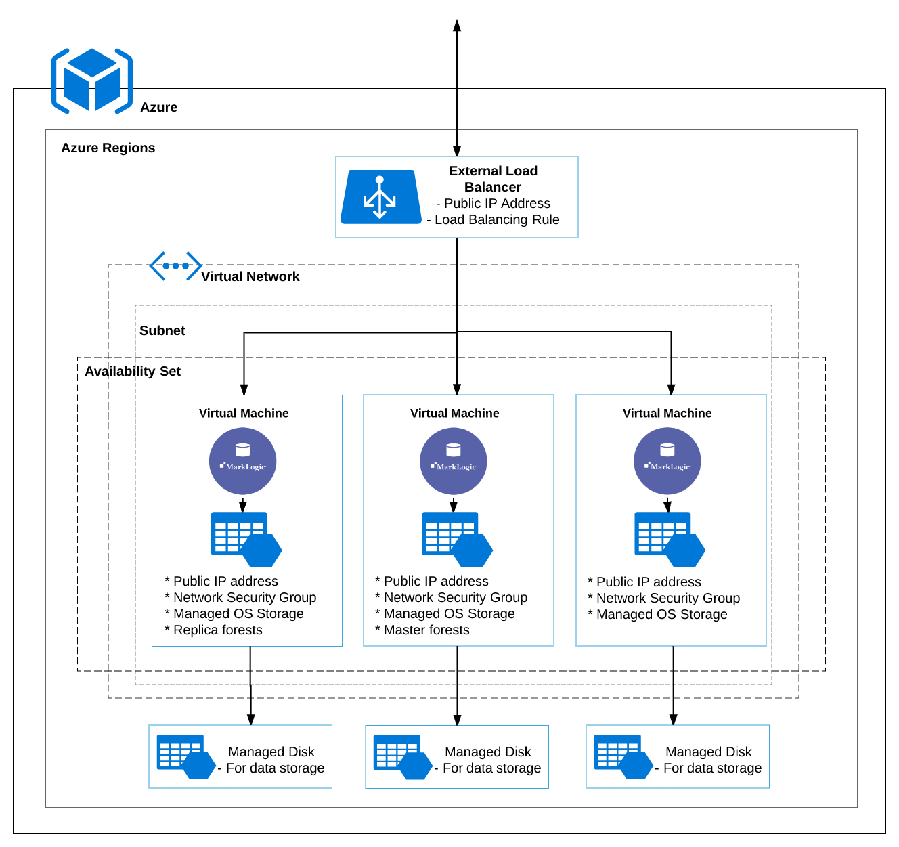

# MarkLogic Solution Template on Azure

This Solution Template deploys MarkLogic clusters on Azure. It is a sample deployment architecture. Users are encouraged to customize the template to fit the needs for different purpose.

## Getting Started

* To deploy from Azure Web Portal, navigate to [Azure Marketplace](https://azuremarketplace.microsoft.com/en-us/marketplace/apps?search=marklogic&page=1) 
* To deploy from this repository, click the `Deploy to Azure` button under the title  
* To deploy using Azure CLI (or other tools), refer to Azure [article](https://docs.microsoft.com/en-us/azure/azure-resource-manager/resource-group-template-deploy-cli)

## Reference Architecture

The template exposes a set of parameters for users to configure the cluster. Depends on the values of parameters, users can choose to provision one node or three nodes clusters with Availability Set, Virtual Network, Load Balancer, Network Security Group and Virtual Machines.

The virtual machines provisioned by the template will each be initialized as a MarkLogic node and join together as a cluster. Advanced features including MarkLogic local-disk failover can be optionally configured on the cluster. The following image shows a typical architecture of the cluster on Azure.

The Solution Template consists of a mainTemplate, createUiDefinition, several sub-templates and shell sripts for configuring MarkLogic cluster. The mainTemplate is the main entrance of the template. It links and invokes sub-templates as needed. The createUiDefinition is used to define Azure Marketplace interface, if you are deploying from this repository or using Azure CLI, createUiDefinition is unrelated. 

## Documentation

- [MarkLogic on Azure](https://developer.marklogic.com/products/cloud/azure)  
